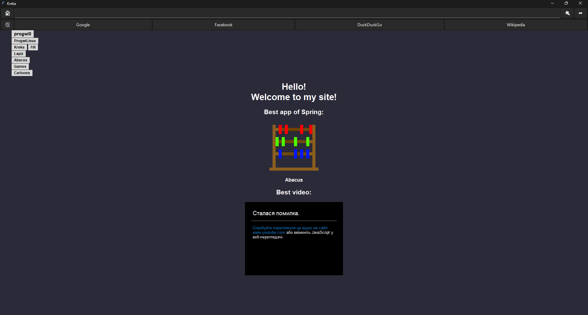

# 🍪 Kreka
🍪 Fast cookie.

Kreka is a fast browser, which can run on every Windows PC!

## 🤷 Why Kreka?
1. Fast browsing.
2. Made on Tkinter.
3. No spy, all is OPEN-SOURCE!

## 🛞 Dependencies!
For run Kreka (from source or nah) you need:
- Python 3.12+
- sv_ttk
- darkdetect
- pywinstyles
- tkinterweb

## 💿 Installation!

You can download Kreka from [releases](https://github.com/progwi0/kreka/releases) or via [Pix](https://github.com/progwi0/pix).

(i tested kreka on win11)
