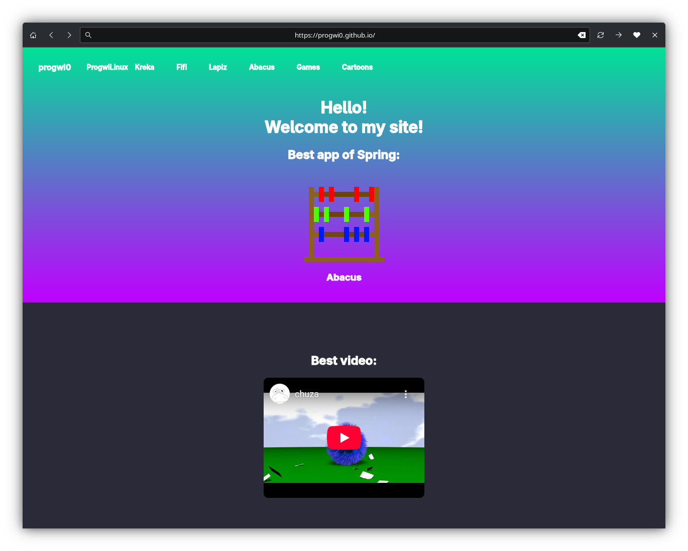

# Kreka

Kreka - simple web-browser on GTK3 👣!

## Features

- 🌐 Simple URL navigation

- 🖥️ Basic CSS/HTML render

- 🖥️ HTTP and HTTPS support.
    
## Installation

You can download Kreka from [releases](https://github.com/progwi0/kreka/releases) or via [Pix](https://github.com/progwi0/pix).
